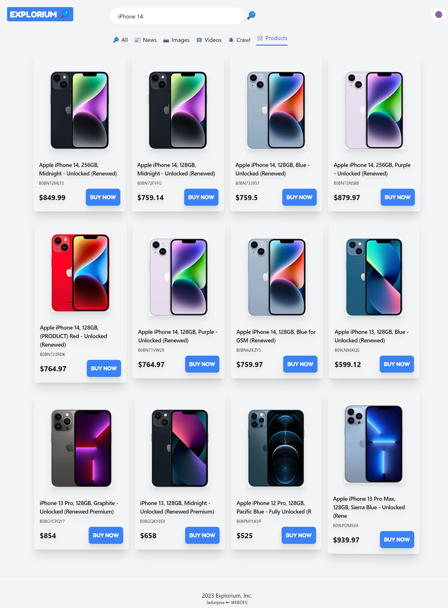

<a name="readme-top"></a>
<div align="center">

  
  

  <h1>Explorium</h1>
  
  <p>
    Explorium is a well-designed <b>Search Engine</b> with content classification tools
  </p>

<!-- Badges -->
<p>
  <a href="https://github.com/ladunjexa/Explorium-Search-Engine/graphs/contributors">
    
  </a>
  <a href="">
    
  </a>
  <a href="https://github.com/ladunjexa/Explorium-Search-Engine/network/members">
    
  </a>
  <a href="https://github.com/ladunjexa/Explorium-Search-Engine/stargazers">
    
  </a>
  <a href="https://github.com/ladunjexa/Explorium-Search-Engine/issues/">
    
  </a>
  <a href="https://github.com/ladunjexa/Explorium-Search-Engine/blob/master/LICENSE">
    
  </a>
</p>
   
 <h4>
    <a href="https://github.com/ladunjexa/Explorium-Search-Engine/">View Demo</a>
  <span> · </span>
    <a href="https://github.com/ladunjexa/Explorium-Search-Engine">Documentation</a>
  <span> · </span>
    <a href="https://github.com/ladunjexa/Explorium-Search-Engine/issues/">Report Bug</a>
  <span> · </span>
    <a href="https://github.com/ladunjexa/Explorium-Search-Engine/issues/">Request Feature</a>
  </h4>
</div>

<br />

<!-- Table of Contents -->
<details>

<summary>

# :notebook_with_decorative_cover: Table of Contents

</summary>

- [About the Project](#star2-about-the-project)
  * [Folder Structure](#bangbang-folder-structure)
  * [Environment Variables](#key-environment-variables)
  * [Tech Stack](#space_invader-tech-stack)
- [Getting Started](#toolbox-getting-started)
  * [Installation](#gear-installation)
  * [Run Locally](#running-run-locally)
- [Contributing](#wave-contributing)
- [License](#warning-license)
- [Contact](#handshake-contact)
- [Acknowledgements](#gem-acknowledgements)

</details>  

<!-- About the Project -->
## :star2: About the Project

<div align="center"> 
  
</div>
<br />

Explorium is a Search Engine app with accurate, real-time search engine results by location, device, and language based on [SEO API](https://rapidapi.com/Serply/api/seo-api) that allows you to find data for SEO, news, images, videos, products and crawlers.

<!-- Folder Structure -->
### :bangbang: Folder Structure

Here is the folder structure of Explorium.
```
Explorium-Search-Engine/
|- public/
|- src/
  |-- assets/
  |-- components/
  |-- contexts/
```

Now, lets dive into the public and src folders.

### public

`index.html` - `manifest.json`

The public folder contains the HTML file so you can tweak it, for example, to set the page title. The <script> tag with the compiled code will be added to it automatically during the build process.

### src

#### assets

`unfound_illustration.svg` - an Illustration that used in case of no results found.

#### components

`Classifier.jsx` - `Footer.jsx` - `Loader.jsx` - `Navbar.jsx` - `Results.jsx` - `Router.jsx` - `Search.jsx`

JSX files contain **Explorium** components which split the UI into independent and reusable pieces.
`Classifier.jsx` - This component display classification links of data.

`Footer.jsx` , `Navbar.jsx` - This components displays the Navigation Bar & Footer.

`Loader.jsx` - Puff loading component for display while waiting to fetching the results from the API.

`Results.jsx` - Results component handles the display form of the fetched results, that is, widgets for the various links.

`Router.jsx` - Router component enables the navigation among views of various components in application.

`Search.jsx` - Search components (includes search field, search button and classification links).

#### contexts

`ResultContextProvider.jsx` - Implementation of Provider React component that allows consuming components to subscribe to context changes, that is, fetch results from API according to data types

<br />

<!-- ENV VARIABLES -->
### :key: Environment Variables

In order to use Explorium you have to create your SEO-API api key powered by RapidAPI [here](https://rapidapi.com/Serply/api/seo-api), to run this web app, you will need to add the following environment variable to your .env file

`REACT_APP_RAPIDAPI_SEO_KEY`

<!-- TechStack -->
### :space_invader: Tech Stack


[](https://rapidapi.com/)

<p align="right">(<a href="#readme-top">back to top</a>)</p>

<!-- Getting Started -->
## 	:toolbox: Getting Started

<!-- Installation -->
### :gear: Installation

#### Step 1:
Download or clone this repo by using the link below:

```bash
 https://github.com/ladunjexa/Explorium-Search-Engine
```

#### Step 2:

Explorium using NPM (Node Package Manager), therefore, make sure that Node.js is installed by execute the following command in console:

```bash
  node -v
```

#### Step 3:

At the main folder execute the following command in console to get the required dependencies:

```bash
  npm install
```

#### Step 4:

Within the main folder create a file named `.env` and add the following [environment variable](#key-environment-variables):


```bash
  REACT_APP_RAPIDAPI_SEO_KEY=<YOUR_API_KEY>
```


<!-- Run Locally -->
### :running: Run Locally

#### Step 1:

At the main folder execute the following command in console to get the required dependencies:

```bash
  npm run start
```

<p align="right">(<a href="#readme-top">back to top</a>)</p>

<!-- Contributing -->
## :wave: Contributing

<a href="https://github.com/ladunjexa/Explorium-Search-Engine/graphs/contributors">
  
</a>


Contributions are always welcome!

See [`contributing.md`](https://contributing.md/) for ways to get started.

Contributions are what make the open source community such an amazing place to learn, inspire, and create. Any contributions you make are **greatly appreciated**.

If you have a suggestion that would make this better, please fork the repo and create a pull request. You can also simply open an issue with the tag "enhancement".
Don't forget to give the project a star! Thanks again!

1. Fork the Project
2. Create your Feature Branch (`git checkout -b feature/AmazingFeature`)
3. Commit your Changes (`git commit -m 'Add some AmazingFeature'`)
4. Push to the Branch (`git push origin feature/AmazingFeature`)
5. Open a Pull Request

<p align="right">(<a href="#readme-top">back to top</a>)</p>

<!-- License -->
## :warning: License

Distributed under the MIT License. See [LICENSE.txt](https://github.com/ladunjexa/Explorium-Search-Engine/blob/main/LICENSE) for more information.

<p align="right">(<a href="#readme-top">back to top</a>)</p>

<!-- Contact -->
## :handshake: Contact

Liron Abutbul - [@lironabutbul6](https://twitter.com/lironabutbul6) - [@ladunjexa](https://t.me/ladunjexa)

Project Link: [https://github.com/ladunjexa/Explorium-Search-Engine](https://github.com/ladunjexa/Explorium-Search-Engine)

<p align="right">(<a href="#readme-top">back to top</a>)</p>

<!-- Acknowledgments -->
## :gem: Acknowledgements

This section used to mention useful resources and libraries that used in Explorium

 - [RapidAPI](https://rapidapi.com/)
 - [Google Fonts](https://fonts.google.com/)
 - #JSMastery

<p align="right">(<a href="#readme-top">back to top</a>)</p>
